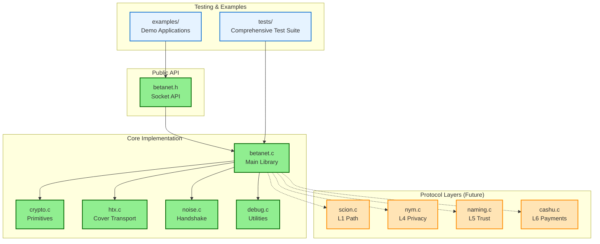

# betanet c library

this is a c library for the betanet protocol. it is currently under development.

the api is strongly inspired/basically the same as the berkeley sockets for familarily, but i also plan to write a futureproof async/event driven high level api with callbacks

## development environment

this project uses [nix](https://nixos.org/) with flakes for a reproducible development environment.

1.  **install nix:** follow the instructions at [nixos.org](https://nixos.org/download.html).
2.  **enable flakes:** if you haven't already, [enable nix flakes](https://nixos.wiki/wiki/flakes#enabling-flakes).
3.  **(optional) use direnv:** install [direnv](https://direnv.net/) and run `direnv allow` in the project root. this will automatically load the development environment when you `cd` into the directory.

alternatively, you can manually enter the development shell by running `nix develop` in the project root.

## building

once you are in the development environment, you can build the project using cmake and make:

```bash
mkdir build
cd build
cmake ..
make
```

## editor setup (vscode)

this project is pre-configured for use with vs code and the recommended extensions.

1.  **install recommended extensions:** open the command palette (`cmd+shift+p`) and run `extensions: show recommended extensions`. install the "c/c++" and "cmake tools" extensions.
2.  **select the nix clang kit:** after reloading the window, open the command palette again and run `cmake: select a kit`. choose "nix clang" from the list.

this will configure intellisense and the linter correctly.

## project architecture



## current status

this project implements core betanet functionality including:

### ✅ fully implemented
- **cryptographic primitives** - sha-256, chacha20-poly1305, hkdf, ed25519, x25519
- **l2 cover transport (htx)** - access-ticket bootstrap, noise xk handshake, frame format (client & server)
- **socket api** - berkeley-style socket interface for both client and server (`connect`, `bind`, `listen`, `accept`)
- **comprehensive test suite** - 50+ tests across multiple test categories with 100% pass rate

### 🚧 current implementation status
- **secure end-to-end connections** - fully encrypted l2 channel between client and server
- **address resolution** - host:port format (betanet:// uri support planned)
- **library lifecycle** - initialization, cleanup, and resource management

### 📋 planned features
- **full protocol stack** - complete l1-l6 integration
- **betanet uri resolution** - distributed naming and trust system
- **privacy features** - adaptive mixnet routing based on privacy mode
- **async api** - event-driven high-performance interface

see the [documentation](docs/) for detailed information about the implementation.

## documentation

comprehensive documentation is available in the [`docs/`](docs/) directory:

- [**development guide**](docs/development.md) - setup, building, and development workflow
- [**testing guide**](docs/testing.md) - running tests and writing new tests
- [**api reference**](docs/api.md) - complete public api documentation with examples
- [**architecture overview**](docs/architecture.md) - internal design and implementation details
- [**contributing guide**](docs/contributing.md) - how to contribute to the project

## usage

the public api is defined in `include/betanet.h`. see the [api reference](docs/api.md) for detailed usage examples and the `examples/` directory for sample applications.

### quick start

```bash
# enter development environment
nix develop

# build the library and examples
cd build
cmake ..
make

# run the api demonstration
./api_demo

# run all tests
ctest
```

### example usage

```c
#include "betanet.h"
#include <stdio.h>
#include <string.h>

int main() {
    // initialize library
    betanet_init(NULL);
    
    // create and configure socket
    betanet_socket_t sock = betanet_socket();
    betanet_privacy_mode_t mode = BETANET_PRIVACY_BALANCED;
    betanet_setsockopt(sock, BETANET_OPT_PRIVACY_MODE, &mode);
    
    // resolve address and connect
    betanet_addr_t addr = betanet_resolve("127.0.0.1:8080");
    if (betanet_connect(sock, addr) != 0) {
        fprintf(stderr, "failed to connect\n");
        // handle error
    }
    
    // send and receive data
    betanet_send(sock, "hello", 5);
    char buffer[1024];
    ssize_t received = betanet_recv(sock, buffer, sizeof(buffer));
    if (received > 0) {
        printf("received: %.*s\n", (int)received, buffer);
    }
    
    // cleanup
    betanet_free_addr(addr);
    betanet_close(sock);
    betanet_cleanup();
    return 0;
}
```