# architecture overview

this document describes the internal architecture and design decisions of the betanet c library.

## layer model

the betanet protocol implements a 7-layer architecture as specified in the [betanet specification](../spec/betanet.md):


**Legend:**
- 🟢 **Green**: Fully implemented with comprehensive testing
- 🟡 **Orange**: Placeholder implementation

## implementation status

### ✅ completed layers

**cryptographic primitives (foundation)**
- location: `src/crypto.c`, `include/betanet.h`
- implements: sha-256, chacha20-poly1305, hkdf-sha256, ed25519, x25519
- status: complete with comprehensive test coverage
- compliance: fully compliant with betanet spec §2

**l2 cover transport (htx)**
- location: `src/htx.c`, `src/noise.c`
- implements: access-ticket bootstrap, noise xk handshake (client & server), frame format with encryption
- status: complete and fully tested implementation for both client and server
- compliance: fully compliant with betanet spec §5

### 🚧 placeholder layers

the following layers have placeholder implementations:

- **l1 path layer** (`src/scion.c`) - scion packet handling
- **l3 overlay mesh** (`src/???`) - libp2p-v2 object relay
- **l4 privacy layer** (`src/nym.c`) - nym mixnet integration  
- **l5 naming & trust** (`src/naming.c`) - self-certifying ids and alias ledger
- **l6 payments** (`src/cashu.c`) - federated cashu and lightning

## module architecture

### core library (`src/betanet.c`)

provides the main socket api and coordinates between layers:

```c
// client socket lifecycle
betanet_socket_t betanet_socket(void);
int betanet_connect(betanet_socket_t sock, betanet_addr_t addr);
ssize_t betanet_send(betanet_socket_t sock, const void* buffer, size_t length);
ssize_t betanet_recv(betanet_socket_t sock, void* buffer, size_t length);
int betanet_close(betanet_socket_t sock);

// server socket lifecycle
int betanet_bind(betanet_socket_t sock, betanet_addr_t local_addr);
int betanet_listen(betanet_socket_t sock, int backlog);
betanet_socket_t betanet_accept(betanet_socket_t sock, betanet_addr_t* client_addr);
```

**design principles:**
- familiar berkeley sockets api for ease of adoption
- opaque handles to hide implementation complexity
- clear separation between public api and internal implementation

### cryptographic foundation (`src/crypto.c`)

implements all cryptographic primitives required by the betanet specification:

**hash functions:**
- `betanet_hash_sha256()` - sha-256 hashing

**authenticated encryption:**
- `betanet_aead_encrypt()` - chacha20-poly1305 encryption
- `betanet_aead_decrypt()` - chacha20-poly1305 decryption

**key derivation:**
- `betanet_kdf_hkdf_sha256()` - hkdf-sha256 key derivation

**digital signatures:**
- `betanet_ed25519_keypair()` - ed25519 key generation
- `betanet_ed25519_sign()` - ed25519 signing
- `betanet_ed25519_verify()` - ed25519 verification

**key exchange:**
- `betanet_x25519_keypair()` - x25519 key generation
- `betanet_x25519_shared_secret()` - x25519 shared secret computation

**security considerations:**
- automatic memory clearing of sensitive data using `sodium_memzero()`
- proper parameter validation for all functions
- constant-time operations where applicable (provided by libsodium)

### l2 cover transport

#### htx implementation (`src/htx.c`)

implements the htx cover transport protocol:

**access-ticket bootstrap (spec §5.2):**
- `htx_generate_access_ticket()` - generates access tickets with x25519 key exchange
- `htx_encode_base64url()` - base64url encoding without padding
- `htx_construct_http_request()` - constructs http requests with various carriers

**frame format (spec §5.4):**
- `htx_serialize_frame_header()` - serializes frame headers with varint encoding
- `htx_deserialize_frame_header()` - deserializes frame headers
- `htx_construct_stream_frame()` - constructs stream frames with optional encryption
- `htx_parse_stream_frame()` - parses stream frames
- `htx_construct_ping_frame()` - constructs ping frames
- `htx_construct_window_update_frame()` - constructs window update frames

**key features:**
- quic-style varint encoding for efficient stream multiplexing
- support for all carrier types (cookie, query parameter, post body)
- variable-length padding for traffic analysis resistance
- proper network byte order handling

#### noise xk handshake (`src/noise.c`)

implements the noise xk handshake pattern for secure channel establishment:

**handshake management:**
- `noise_handshake_init()` - initializes handshake state for client or server
- `noise_write_message()` - generates handshake messages for the appropriate role (initiator/responder)
- `noise_read_message()` - processes handshake messages for the appropriate role
- `noise_handshake_finalize()` - derives transport keys

**noise xk pattern implementation:**
```
-> e
<- e, ee, s, es
-> s, se
```

**security features:**
- proper hash chaining and key mixing using hkdf
- authenticated encryption with chacha20-poly1305 for handshake and transport
- forward secrecy through ephemeral key exchange
- transport key derivation, separation, and secure clearing

## data structures

### opaque handles

the public api uses opaque handles to hide implementation details:

```c
typedef struct betanet_socket_struct* betanet_socket_t;
typedef struct betanet_addr_struct* betanet_addr_t;
```

this allows the implementation to change without breaking api compatibility.

### internal structures

**`betanet_socket_struct`**
the core internal structure representing a socket. it contains:
- file descriptor for the underlying tcp socket.
- connection state (connecting, connected, listening, etc.).
- local and remote address information.
- a `noise_transport_state_t` structure for the secure channel.
- the server's static keypair (for listening sockets).

## communication flow

### client-server handshake sequence


### frame parsing flow

```mermaid
flowchart TD
    A[Receive TCP Data] --> B{Read Header Bytes}
    B -->|4 bytes| C[Parse Length + Type]
    C --> D{Frame Type?}
    D -->|Non-Stream| E[Complete Header<br/>4 bytes total]
    D -->|Stream Frame| F{Need Stream ID}
    F --> G[Read Additional Bytes<br/>for Varint Stream ID]
    G --> H[Parse Complete Header<br/>5+ bytes total]
    
    E --> I[Read Payload]
    H --> I
    I --> J[Decrypt if Encrypted]
    J --> K[Deliver to Application]
    
    F -.->|❌ Bug: Only read 4 bytes| L[❌ Header Parse Fails<br/>Missing Stream ID]
    L --> M[❌ Connection Fails]
    
    classDef error fill:#ffcccc,stroke:#ff0000,stroke-width:2px
    classDef success fill:#ccffcc,stroke:#00aa00,stroke-width:2px
    classDef warning fill:#fff3cd,stroke:#856404,stroke-width:2px
    
    class L,M error
    class E,H,I,J,K success
    class F warning
```



**`noise_handshake_state_t`**
```c
typedef struct {
    uint8_t h[32];                             // handshake hash
    uint8_t ck[32];                            // chaining key
    uint8_t k[32];                             // encryption key
    uint64_t n;                                // nonce counter
    uint8_t s[32], s_pub[32];                  // local static keys
    uint8_t e[32], e_pub[32];                  // local ephemeral keys
    uint8_t rs[32], re[32];                    // remote keys
    int initiator;                             // role
    int message_patterns_complete;             // progress
    int has_key;                               // encryption available
} noise_handshake_state_t;
```

## memory management

### allocation strategy

- **stack allocation** for temporary data and small structures
- **minimal heap allocation** to reduce complexity and potential leaks
- **opaque handles** to manage complex state internally

### security considerations

- **automatic cleanup** of sensitive data using `sodium_memzero()`
- **explicit parameter validation** for all public functions
- **null pointer checks** throughout the codebase
- **bounds checking** for all buffer operations

## error handling

### error code conventions

```c
// general functions
return 0;    // success
return -1;   // error

// cryptographic functions  
typedef enum {
    BETANET_CRYPTO_OK = 0,
    BETANET_CRYPTO_ERROR = -1,
    BETANET_CRYPTO_INVALID_PARAM = -2,
    BETANET_CRYPTO_VERIFY_FAILED = -3
} betanet_crypto_result_t;
```

### logging

internal logging provides visibility into protocol operations for debugging. logging is compiled out in release builds to avoid performance overhead and information leakage.

### error propagation

- errors are propagated up the call stack
- sensitive cleanup is performed even on error paths
- detailed error information is logged internally but not exposed to prevent information leakage

## build system

### cmake configuration

the project uses cmake with the following key features:

- **nix integration** for reproducible builds
- **dependency management** via pkg-config
- **comprehensive testing** with cmocka integration
- **compilation database** generation for ide support

### dependency management

**required dependencies:**
- **libsodium** - cryptographic primitives
- **openssl** - tls and additional crypto (future use)

**optional dependencies:**
- **cmocka** - unit testing framework
- **liboqs** - post-quantum cryptography (future use)
- **libuv** - async i/o (future use)
- **libcbor** - cbor encoding (future use)

## testing architecture

### test pyramid structure


### test organization

```
tests/
├── betanet_internal.h              # internal api exposure
├── test_core.c                     # library lifecycle tests
├── test_crypto.c                   # cryptographic function tests
├── test_htx.c                      # htx access-ticket tests
├── test_noise.c                    # noise xk handshake tests
├── test_htx_frames.c               # htx frame format tests
├── test_api.c                      # public api tests
├── test_l2_secure_channel.c        # l2 secure channel integration tests
├── test_server.c                   # server-side functionality tests
├── test_smoke_client_server.c      # fast smoke tests for basic functionality
└── test_integration_client_server.c # full end-to-end communication tests
```

### test categories

**unit tests:**
- test individual functions in isolation
- verify correct behavior with valid inputs
- verify error handling with invalid inputs

**integration tests:**
- test complete protocol flows
- verify inter-module communication
- test realistic usage scenarios

**smoke tests:**
- fast regression tests for critical functionality
- catch breaking changes in CI/CD
- validate frame parsing and basic protocol operations

**end-to-end tests:**
- full client-server communication scenarios
- multi-threaded test environments
- real handshake and data exchange validation

**security tests:**
- verify cryptographic correctness using known test vectors
- test memory clearing and security properties
- validate protocol compliance

## performance considerations

### optimization strategies

- **zero-copy operations** where possible
- **stack allocation** for temporary data
- **efficient serialization** using network byte order
- **minimal system calls** through batching

### scalability design

the current implementation focuses on correctness and security. future optimizations may include:

- **connection pooling** for multiple simultaneous connections
- **async i/o** using libuv for high-performance servers
- **memory pools** for frequent allocations
- **simd optimizations** for cryptographic operations

## security architecture

### threat model

the library is designed to resist:

- **network surveillance** through cover traffic and encryption
- **traffic analysis** through padding and timing randomization
- **censorship** through indistinguishable traffic patterns
- **compromise** through forward secrecy and key isolation

### security boundaries

- **process isolation** - library runs in application process
- **memory protection** - sensitive data cleared after use
- **key isolation** - separate keys for different purposes
- **protocol isolation** - each layer has distinct security properties

### compliance

the implementation follows security best practices:

- **secure coding standards** with explicit bounds checking
- **cryptographic standards** using well-vetted primitives
- **protocol standards** following the betanet specification exactly
- **testing standards** with comprehensive security test coverage

## future development

### planned improvements

**l1 path layer:**
- full scion packet handling
- path discovery and validation
- multi-path routing

**l3 overlay mesh:**
- libp2p-v2 integration
- content-addressed storage
- peer discovery and routing

**l4 privacy layer:**
- nym mixnet integration
- adaptive privacy modes
- traffic analysis resistance

**l5 naming & trust:**
- self-certifying identifiers
- distributed alias ledger
- trust metrics and reputation

**l6 payments:**
- federated cashu integration
- lightning network support
- micropayment channels

### api evolution

the api is designed for stability:

- **opaque handles** allow internal changes without api breaks
- **version negotiation** will be added for protocol evolution
- **feature detection** will allow graceful degradation
- **backward compatibility** will be maintained where possible
